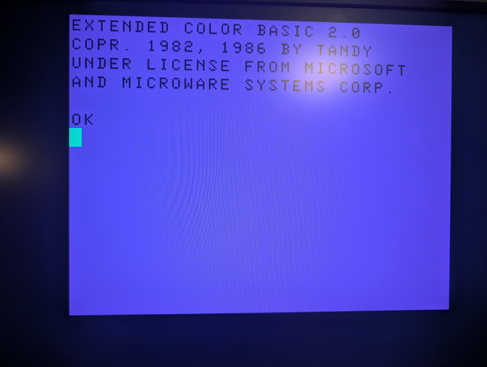

# CoCo3FPGA for QMTECH Wukong V3

This repository is a hardware port of
[richard42/CoCo3FPGA](https://github.com/richard42/CoCo3FPGA). It preserves the
original Quartus sources while adding an AMD/Xilinx Vivado implementation for
the QMTECH Wukong V3 FPGA development board.

The current port targets the Wukong V3 fitted with an Artix-7 `XC7A100T` in
the FGG676 package. The hardware-verified build boots a 128 KiB CoCo 3 system
ROM from block RAM and displays Extended Color BASIC over the board's HDMI
connector. Test-pattern, legacy-video, and CPU-diagnostic images remain
available as separate build modes.

The long-term target family includes boards based on the Artix-7 `XC7A15T`,
`XC7A50T`, and `XC7A100T`. The RTL is being kept portable across those devices;
the Wukong V3 `XC7A100T` is the currently implemented and hardware-verified
board target.

Hardware interface documentation is maintained under [`hardware/`](hardware/):

- [QMTECH Wukong V3 board overview](hardware/wukong-board.md)
- [Wukong V3 PMOD pinout](hardware/wukong-pmod-pinout.md)
- [PS/2 keyboard interface](hardware/keyboard-ps2.md)



*Hardware checkpoint: Extended Color BASIC 2.0 with corrected GIME colors and
vertical centering, running from block RAM and displayed over HDMI on the
QMTECH Wukong V3.*

## Repository layout

```text
CoCo3FPGA/
|-- rtl/              Verilog and VHDL sources
|   |-- core/         Portable CoCo memory, ROM, and boot-machine modules
|   `-- wukong/       Wukong top level, clocking, HDMI, and system integration
|-- constraints/      Board-specific XDC constraints
|-- scripts/          Vivado build, ROM preparation, and simulation scripts
|-- ip/               Vivado-generated IP
|-- tb/               Testbench sources
|-- build/            Generated ROM images, reports, checkpoints, and bitstreams
|-- roms/             User-supplied ROM inputs; ROM binaries are ignored by Git
|-- hardware/         Wukong interface pinouts and external wiring guides
|-- docs/              Porting notes, bring-up results, and board documentation
`-- legacy-quartus/    Original Intel/Altera Quartus project and support files
```

Generated content under `build/` is not committed.

## Requirements

- Windows PowerShell
- AMD Vivado with support for the Artix-7 `XC7A100T`
- A legally obtained CoCo system ROM

The launcher defaults to Vivado 2025.2 at:

```text
C:\AMD\2025.2\Vivado\bin\vivado.bat
```

Pass `-Vivado` to the build script if Vivado is installed elsewhere.

## ROM preparation

CoCo ROM images may be obtained from the vetted
[RetroBIOS Tandy CoCo collection](https://github.com/Abdess/retrobios/tree/main/bios/Tandy/CoCo).
ROM binaries are inputs to the build and must remain uncommitted.

For the CoCo 3 build, place a compatible image at `roms/coco3.rom`, then run
from the repository root:

```powershell
& .\scripts\prepare_coco3_rom.ps1
```

The importer accepts either a raw 32 KiB CoCo 3 image or the historical
32,258-byte CoCo3FPGA flash format. It validates the reset vector, prints the
source SHA-256 digest, and writes `build/roms/coco3.mem` for Vivado.

## Building a bitstream

Prepare the appropriate ROM first, then build the hardware-verified CoCo 3
image from the repository root:

```powershell
& .\scripts\build_wukong.ps1 -Mode COCO3_BOOT
```

On success, program the board with:

```text
build/wukong/wukong_coco3_boot.bit
```

The build performs synthesis, implementation, design-rule checks, timing
analysis, and bitstream generation. It refuses to generate a bitstream if the
design has negative timing slack.

Other selectable modes are:

| Mode | Output | Purpose |
|---|---|---|
| `TEST_PATTERN` | `wukong_hdmi_test.bit` | Standalone HDMI test image |
| `COCO_VIDEO` | `wukong_coco_video.bit` | Legacy CoCo video-core checkpoint |
| `CPU_DIAGNOSTIC` | `wukong_cpu_diagnostic.bit` | CPU and 128 KiB block-RAM diagnostic |
| `COCO3_BOOT` | `wukong_coco3_boot.bit` | CoCo 3 ROM boot |

For example, to use another Vivado installation or compatible FPGA part:

```powershell
& .\scripts\build_wukong.ps1 `
    -Vivado 'D:\AMD\Vivado\2025.2\bin\vivado.bat' `
    -Part 'xc7a100tfgg676-2' `
    -Mode COCO3_BOOT
```

## Documentation and references

- [Wukong port notes](docs/WUKONG_PORT.md)
- [Core integration plan](docs/WUKONG_CORE_INTEGRATION.md)
- [Hardware bring-up record](docs/BRINGUP.md)
- [Original CoCo3FPGA project](https://github.com/richard42/CoCo3FPGA)
- [RetroBIOS Tandy CoCo ROM collection](https://github.com/Abdess/retrobios/tree/main/bios/Tandy/CoCo)

See [LICENSE](LICENSE) for the source-code license. ROM images may have separate
terms and are intentionally not distributed by this repository.
