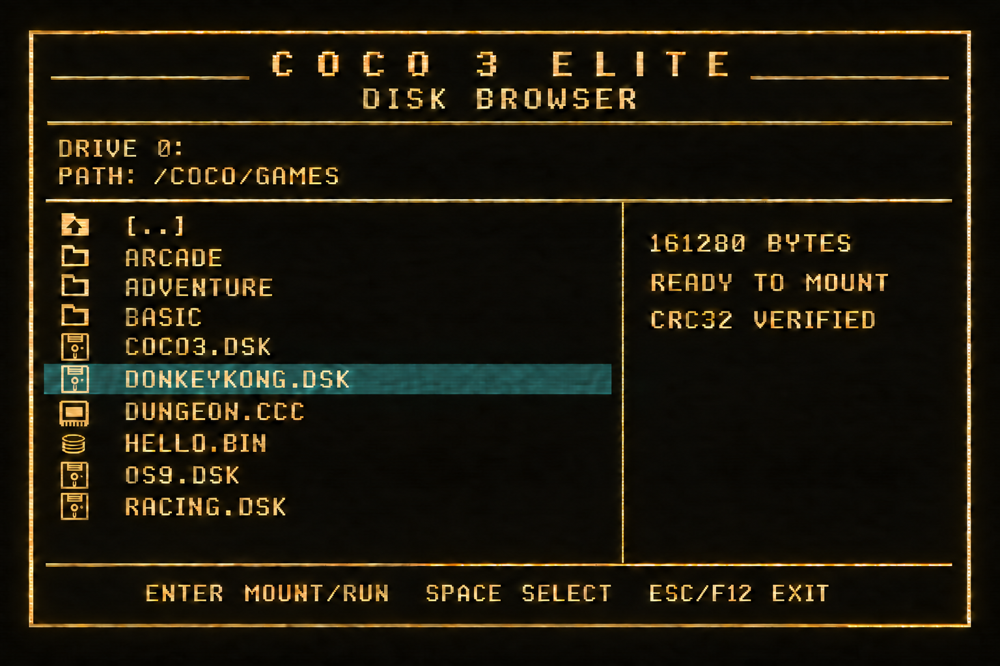
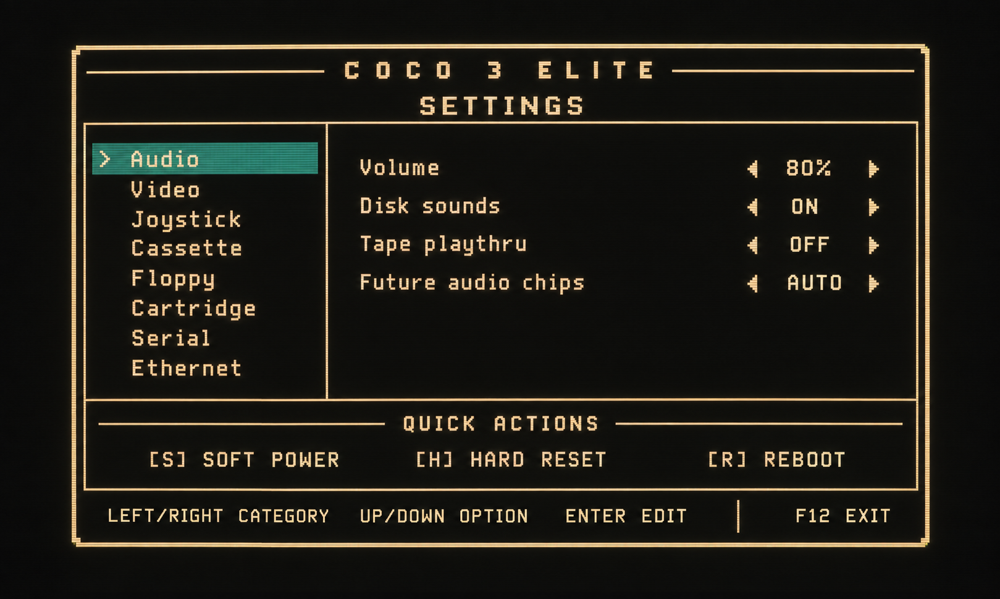

# CoCo 3 Elite management UI

This document defines the visual direction, interaction model, and implementation plan for the FPGA management interface. The management processor owns the UI and opens it over the running CoCo display with **F12**.

The images below are design references. They define the intended layout and style; they are not screenshots of the current implementation.

## Visual references

### Disk and file browser

### Settings

### Logo wordmark

## Current implementation

The current firmware provides a functional 72-column by 28-row character overlay. The first visual refresh implements the mockup's framed layout, light gold-on-black palette, solid amber reverse-video file selection, split file/detail panes, graphical directory, disk, cartridge, and BIN icons, and custom glyphs for a three-pixel rounded outer frame and continuous panel lines. Three real bitmap typefaces—Spleen, Tamzen, and Terminus—are selectable without changing CoCo software's character generator. Fixed labels use sentence case for easier reading. The browser header uses the `CoCo 3 /// Elite` wordmark with dedicated three-pixel red, green, and blue slash glyphs. The corner arcs join directly to the side and top/bottom strokes, while interior horizontal separators stop five pixels before the outer frame instead of forming hard T-junctions. It can:

- open Settings with F11;
- open and close the file browser with F12;
- browse FAT32 directories, including parent-directory navigation and long filenames;
- mount a `.DSK` image as drive 0;
- cold-start compatible `.CCC` cartridge images;
- validate, load, and execute DECB `.BIN` files;
- report SD-card, mount, and load failures;
- detect SD removal and reinsertions without writing a stale disk cache.

The current browser is implemented in `firmware/management/rv32_sd_mount.c`; the F11 Settings screen is implemented in `firmware/management/settings_ui.c`. Both use the palette and icon glyphs in `rtl/management/manager_osd.v`. The UI font banks are stored in `rtl/management/manager_fonts.mem`; their source fonts, licenses, attribution, and generator are under `rtl/management/fonts` and `scripts`.

## Target visual language

The UI should look like a polished extension of the CoCo rather than a modern desktop window:

- black or very dark translucent background;
- warm amber text, borders, and icons;
- solid amber/gold selection bar with black reverse-video text;
- fixed-width, pixel-oriented character shapes;
- thin double-line outer border and single-line panel dividers;
- restrained animation and no effects that interfere with video timing;
- consistent spacing and alignment across every screen.

The mockups use a 4:3 frame with generous safe margins. The compositor must center the overlay from the active video area rather than from raw HDMI timing totals. This avoids the offset and clipping problems seen in early OSD builds.

## Common screen structure

Every management screen should use the same shell:

1. A header containing `COCO 3 ELITE` and the current screen title.
2. A context area for the selected drive, path, category, or device.
3. A primary content area divided into panes when useful.
4. A status line for progress, validation, and errors.
5. A footer showing only the controls valid on the current screen.

Long operations should immediately display a clear status such as `READING DIRECTORY`, `MOUNTING DRIVE 0`, or `LOADING CARTRIDGE`. Errors should remain visible until acknowledged instead of closing the menu.

## Disk and file browser

The browser is the default F12 screen. Its target layout has a file list on the left and details for the selected entry on the right.

### Header and context

- Display the selected target drive.
- Display the complete current FAT32 path.
- Truncate long paths in the middle when necessary so the final directory remains visible.
- Show media-offline status in the same location when no SD card is present.

### File list

Use distinct icons or textual markers for:

- parent directory;
- directory;
- `.DSK` disk image;
- `.CCC` cartridge image;
- `.BIN` DECB executable;
- future `.BAS` program support;
- unsupported files, which should normally be hidden unless an option enables them.

The mounted image should have a persistent marker independent of the selection bar. Long filenames should be preserved in firmware and clipped only while drawing. Scrolling should keep the selection visible and should not rescan the directory on every key press.

### Detail pane

For the selected item, show information that is already known without delaying navigation:

- file size;
- file type and intended action;
- mounted drive, if applicable;
- read-only or write-protected state;
- validation state or CRC32 when calculated;
- compatibility notes for unsupported cartridge mappers or BIN layouts.

CRC calculation should be performed while loading or on explicit request, not every time the highlight moves.

### Browser controls

- **Up/Down:** move through entries.
- **Enter:** open a directory, mount a disk, or launch a supported file.
- **Space:** select the destination drive or open a small drive-assignment action, once multi-drive mounting is implemented.
- **Esc/F12:** close the UI and return to the CoCo.

Potentially destructive actions, such as discarding dirty cached sectors or replacing a mounted writable disk, must require confirmation or a successful flush first.

## Settings screen

F11 opens the Settings screen. It uses a category list on the left and a design summary on the right. The initial categories are:

- Audio
- Video
- Joystick
- Cassette
- Floppy
- Cartridge
- Serial
- Ethernet

The Video page provides five live settings:

- management font: Spleen, Tamzen, or Terminus (Tamzen is the default);
- artifact style: Off, Thin, Classic, MAME, XRoar, or Two pass (default);
- artifact model: blue/orange, cyan/red, green/magenta, or violet/lime;
- CoCo 2 palette: Original, Base, C64, Atari, CGA, Earth, Amber, Cool
  adventure, CoCo artifact, Forest, Fire, Ice, Purple dusk, Game Boy,
  Ocean/sunset, or Neutral grayscale;
- text colors: Original, C64, Atari, VT100, VT220 amber, VT220 green, IBM,
  Apple II, Amstrad, or Paperwhite.

Every CoCo 2 palette preset still contains exactly four simultaneously active
colors. The wider list changes only which four-color theme is selected.

Thin artifact mode colors only the asserted source half of a transition and
therefore avoids the apparent doubled horizontal line thickness of the
classic pair-wide decoder. Base maps the original green, yellow, blue, and red
slots to black, light brown, brown, and dark green respectively. The remaining
presets provide machine-inspired and purpose-specific four-color mappings. Palette
replacement is limited to MC6847/CoCo-compatible output and does not alter
software-visible CoCo 3 GIME palette registers. Changes preview immediately
and last until FPGA reset or reconfiguration.

Text colors are independent of the four-color graphics palette. A text theme
recolors the foreground glyph, background, and border of the MC6847-compatible
32-column alpha screen. It does not modify display RAM, GIME palette registers,
native CoCo 3 text modes, or bitmap lettering drawn inside graphics modes.

Thin and Classic artifact styles use the FPGA's original two-pixel streaming
decoder. MAME style uses MAME's actual six-pixel, two-output correction-table
addressing from its MC6847 renderer. XRoar style uses the phase-aware five-pixel
cross-colour lookup table from XRoar's video renderer. Two pass first produces
the Thin result and then fills exactly one black output pixel when its
immediate neighbors are the same blue or orange artifact phase. It never fills
between white pixels, mixed phases, or across a wider gap. The blue/orange,
cyan/red, green/magenta, and violet/lime artifact models remain a separate
color selection for the legacy decoder. All styles share a six-pixel-clock
pipeline. They add only small lookup and pipeline logic: no framebuffer or
additional block RAM is required. The imported MAME algorithm is
BSD-3-Clause; the XRoar lookup data is GPL-3.0-or-later.

### Settings controls

- **Up/Down:** move in the currently focused category or option pane.
- **Tab:** switch between the category and option panes.
- **Right or Enter on a category:** move into its option pane.
- **Enter on an editable Video option:** begin editing; Left/Right previews
  choices and a second Enter accepts the current value.
- **Escape while editing:** cancel and restore the value active before editing.
- **Left from an option:** return to the category pane.
- **Esc, F11, or F12 when not editing:** close Settings and return to the CoCo.

Closing and reopening Settings restores the last category, pane, and highlighted
option. Edit mode itself is not retained, so reopening returns safely to the
same field without immediately changing it. This position is held in management
firmware RAM and is intentionally cleared by an FPGA or management-CPU reboot.

Future editable values should be staged while editing. Persistent settings require an explicit Apply operation after nonvolatile storage is available; Cancel must restore the values present when the screen opened.

### Quick actions

The lower panel reserves shortcuts for:

- soft power or pause;
- hard CoCo reset;
- management-system reboot.

Quick actions are commands, not persistent settings. Hard reset and reboot should require confirmation. Resetting the CoCo must leave the management processor, mounted-disk metadata, and SD service in a defined state.

## SD-card behavior

- F12 must remain available before an SD card is initialized and when no card is inserted.
- Removing the card marks the media offline immediately and prevents dirty cache writeback.
- A mounted disk becomes unavailable after removal; it must not silently continue as writable media.
- Reinserting a card remounts FAT32 and refreshes the directory listing.
- A previously mounted file may be restored only after its identity and allocation are verified.
- The UI must clearly distinguish `NO SD CARD`, `READING CARD`, `READY`, and `MEDIA CHANGED`.

## Technical work required

The disk browser now uses 72 by 28 character cells, providing a wider 576-pixel browser with small horizontal and vertical margins and 17 visible file entries. The remaining implementation should be staged:

1. Refactor browser and Settings drawing into reusable screen, pane, list, status, and footer helpers.
2. Add a stable OSD geometry interface so firmware reads the supported columns and rows instead of compiling different assumptions.
3. Add per-cell foreground/background attributes or a small style table for additional warning and disabled states.
4. Extend the settings MMIO only for options with defined hardware behavior; font, artifact, and CoCo 2 palette controls are implemented.
5. Add editing and validation one category at a time where immediate preview is not appropriate.
6. Add persistence after the settings format and storage location are versioned.

The file service, FAT32 parser, disk cache, and cartridge/BIN loaders should remain firmware responsibilities. HDL should provide deterministic primitives: character/attribute RAM, keyboard events, settings registers, reset controls, and storage/cache interfaces.

## Acceptance criteria

- F12 opens and closes reliably at boot, without an SD card, and while CoCo software is running.
- The overlay is centered, fully visible, and stable in every supported video mode.
- The browser navigates subdirectories and displays long filenames without corruption.
- Selection, mounted-file, disabled, warning, and error states are visually distinct.
- Disk mounting, cartridge launching, and BIN execution retain their current behavior.
- SD removal never triggers stale writeback; reinsertion produces a fresh directory scan.
- Video settings preview immediately, Enter accepts them, and Escape restores the pre-edit value; other categories remain informational.
- The UI remains responsive while the CoCo is reset or paused.
- Automated tests cover navigation, clipping, scrolling, media changes, and MMIO state transitions.

## Scope note

These mockups are the target design language, not a requirement to reproduce glow, texture, or photographic effects in FPGA logic. The first hardware implementation should prioritize exact alignment, readable typography, consistent colors, and reliable interaction. Optional visual effects can be evaluated after timing and memory usage are known.
