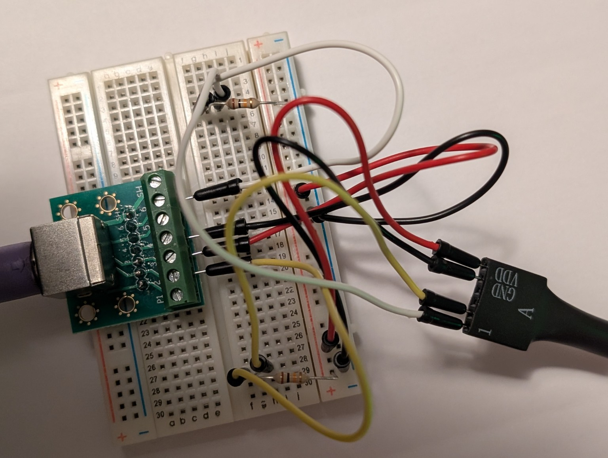

# PS/2 Keyboard Interface

## Purpose

The CoCo3FPGA core uses a PS/2 keyboard as its primary keyboard input. The
existing RTL receives PS/2 scan codes and converts them into the CoCo keyboard
matrix, so the Wukong port should retain this interface for its first working
keyboard implementation.

This interface is implemented and hardware-verified in the Wukong
`COCO3_BOOT` build. Typing and editing BASIC programs, `RUN`, `LIST`, and the
Break key have been tested successfully.

## Recommended Wukong connection

Use PMOD connector J14 for the two PS/2 signals:

| Function | J14 pin | FPGA pin | I/O standard |
| --- | ---: | --- | --- |
| PS/2 data | 1 | P23 | LVCMOS33 |
| PS/2 clock | 3 | T24 | LVCMOS33 |
| Ground | 5 | GND | — |
| Keyboard power | 6 | 3.3 V | — |

J14 pins 1 and 3 match the standard Digilent PS/2 Pmod signal layout. Other
unused PMOD signal pins can be substituted by
changing the constraints.

## Verified 3.3 V keyboard connection

The hardware-verified keyboard is an **HP KB-0133**, confirmed to operate from
3.3 V in this configuration. It can therefore be powered from J14 pin 6 and
connected to the two LVCMOS33 FPGA inputs:

| PS/2 keyboard | Wukong J14 |
| --- | --- |
| Clock | Pin 1 (`P23`) |
| Data | Pin 2 (`R23`) |
| Ground | Pin 5 (GND) |
| Power | Pin 6 (3.3 V) |

Confirm the keyboard is the verified 3.3 V model before connecting it. Its
clock and data pull-ups must not drive either FPGA input above 3.3 V.



*PS/2 interface wiring used during hardware testing with the HP KB-0133. Check
the connector pinout and voltages independently before reproducing this setup.*

## PS/2 key mapping

Letters, digits, Enter, Space, both Shift keys, Ctrl, Alt, F1, F2, and the four
cursor keys map to their corresponding CoCo keys. The following PC keys have
special CoCo meanings or control FPGA features:

| PS/2 keyboard key | CoCo key or action | Notes |
| --- | --- | --- |
| Esc | Break | Hardware-verified with Extended Color BASIC |
| Backspace | Left Arrow | The CoCo uses Left Arrow as its destructive backspace key |
| Tab | Clear | Hardware-verified; invokes the CoCo Clear function |
| F1 | CoCo F1 | Direct CoCo keyboard-matrix mapping |
| F2 | CoCo F2 | Direct CoCo keyboard-matrix mapping |
| F3 | ZIA diagnostics | Presents the embedded [ZIA cocodiag cartridge](https://github.com/varmfskii/cocodiag) to the initialized CoCo and starts it through the system ROM's emulated CART/FIRQ autostart path; Ctrl+Alt+Delete deselects it and returns to Disk Extended Color BASIC |
| F4–F5 | Unmapped | Reserved for future use |
| F6 | Processor speed | Toggles between normal speed (approximately 0.9 MHz) and fast speed (approximately 1.8 MHz); normal speed is selected after FPGA reset |
| F7 | Keyboard right joystick | Toggles W/S/A/D/F control of the emulated right joystick; disabled after reset |
| F8 | Keyboard left joystick | Toggles arrow-key and Space control of the emulated left joystick; disabled after reset |
| F9 | Horizontal scanlines | Toggles horizontal CRT scanlines on or off; disabled after reset |
| F10 | Phosphor glow | Toggles HDMI phosphor bloom/glow on or off independently of scanlines; disabled after reset |
| F11 | NTSC artifact color | Toggles HDMI artifact-color processing on or off; enabled after reset |
| F12 | `@` currently; management GUI planned | Will be reserved to open or close the HDMI management overlay when that subsystem is implemented |
| Caps Lock | Upper/lower case | Switches the CoCo between upper- and lowercase input; hardware-verified |
| Scroll Lock | `Ctrl+W` | Generates the CoCo control-key combination while held |

The PC punctuation keys are translated into the combinations available in the
CoCo keyboard matrix. This makes the printed legends behave naturally even
where the CoCo has no matching physical key:

| PS/2 legend | CoCo matrix combination |
| --- | --- |
| `@` (`Shift+2`) | CoCo `@` |
| `~` (grave/tilde key) | `Ctrl+3` |
| `^` (`Shift+6`) | `Ctrl+7` |
| `&` (`Shift+7`) | `Shift+6` |
| `*` (`Shift+8`) | `Shift+:` |
| `(` / `)` | `Shift+8` / `Shift+9` |
| `_` (`Shift+-`) | `Ctrl+-` |
| `=` / `+` | `Shift+-` / `Shift+;` |
| `\\` / `|` | `Ctrl+/` / `Ctrl+1` |
| `[` / `]` | `Ctrl+8` / `Ctrl+9` |
| `{` / `}` | `Ctrl+,` / `Ctrl+.` |
| `'` / `"` | `Shift+7` / `Shift+2` |

When F8 keyboard-joystick mode is enabled, Up produces minimum Y, Down maximum
Y, Left minimum X, Right maximum X, and Space presses the left joystick's
primary fire button. Opposing directions return that axis to center. These five
keys are consumed by the joystick while the mode is active and return to their
normal CoCo keyboard meanings when F8 disables it.

When F7 keyboard-joystick mode is enabled, W produces minimum Y, S maximum Y,
A minimum X, D maximum X, and F presses the right joystick's primary fire
button. Opposing directions return that axis to center. These five keys are
consumed by the joystick while the mode is active and return to their normal
CoCo keyboard meanings when F7 disables it.

F4 through F5 and the Insert, Home, End, Page Up, Page Down, Print Screen,
Pause, and numeric-keypad navigation keys are not currently mapped. The
Ctrl+Alt+Delete combination performs a synchronized CoCo soft reset. It resets
the emulated CPU and video/control state without reconfiguring the FPGA or
interrupting the HDMI clock generator. Because Ctrl+Alt is also the CoCo 3 ROM
Easter-egg chord, the soft-reset controller masks the keyboard and holds reset
until the keys are released, followed by a 100 ms guard interval. Normal reset
therefore returns to Disk Extended Color BASIC rather than the Easter egg.

The planned management keyboard arbiter will consume the four arrow keys,
Enter, Esc, and F12 while its GUI is open. Up and Down will change the
highlighted item, Left and Right will change a value or navigate between panes,
Enter will select, Esc will return to the previous screen, and F12 will close
the GUI. Once F12 is reserved, the CoCo `@` character will remain available
with Shift+2.

## Other PS/2 keyboards

Many PS/2 keyboards expect a 5 V supply. The Artix-7 FPGA I/O is not 5 V
tolerant, so a 5 V keyboard must not be connected directly to J14.

For a 5 V keyboard, use a two-channel, bidirectional, open-drain-compatible
level shifter between the keyboard and J14. A BSS138-based I2C level-shifter
module is suitable for PS/2 clock and data:

| PS/2 side | Level shifter | Wukong side |
| --- | --- | --- |
| Data | HV channel 1 to LV channel 1 | J14 pin 1 |
| Clock | HV channel 2 to LV channel 2 | J14 pin 3 |
| +5 V | HV supply | Regulated 5 V supply |
| Ground | GND | J14 pin 5 and 5 V supply ground |
| — | LV supply | J14 pin 6 (3.3 V) |

The PMOD connector does not provide 5 V. Obtain 5 V keyboard power from a
verified regulated point or a separate supply, and connect its ground to the
Wukong ground. Verify all supply and signal voltages before connecting it.

## Vivado constraints

When `ps2_clk` and `ps2_data` have been added to `wukong_top`, add these lines
to `constraints/wukong.xdc`:

```tcl
set_property -dict { PACKAGE_PIN P23 IOSTANDARD LVCMOS33 } [get_ports ps2_clk]
set_property -dict { PACKAGE_PIN R23 IOSTANDARD LVCMOS33 } [get_ports ps2_data]
```

PS/2 clock is generated by the keyboard and is not a design timing clock. It
should be synchronized and decoded by the existing `rtl/ps2_keyboard.v` logic,
not added with `create_clock`.

## Existing RTL path

The relevant existing source files are:

- `rtl/ps2_keyboard.v` — receives serial PS/2 frames and scan codes.
- `rtl/cocokey.v` — maps scan codes to CoCo key states.
- `rtl/core/coco3_keyboard_matrix.v` — converts those key states into the
  active-low CoCo matrix rows read through PIA0.

The Wukong top-level integration carries `ps2_clk` and `ps2_data` from the FPGA
pins to this path.

## Keyboard compatibility

A native PS/2 keyboard is the most reliable option. Passive USB-to-PS/2 plug
adapters work only with USB keyboards that explicitly support the PS/2
protocol. For an ordinary USB keyboard, use an active USB-host converter that
outputs PS/2 signaling or scan codes.

The Wukong Mini-USB connector cannot host a USB keyboard. It is connected to
the onboard CH340N USB-to-UART bridge and appears to a computer as a serial
device.

## Initial test procedure

1. Check the direct connection or level-shifter wiring, as applicable, and
   confirm all supply and signal voltages with a meter.
2. Program a bitstream that includes the PS/2 top-level ports and constraints.
3. Connect the PS/2 keyboard only after the board supplies are stable.
4. Confirm that the CoCo BASIC cursor responds to letter, number, Enter,
   Backspace, Shift, and arrow keys.
5. Test key release and shifted-key behavior before adding USB conversion.

## Board references

The Wukong connector assignments and electrical details are documented in the
PDF manuals under `docs/`.
