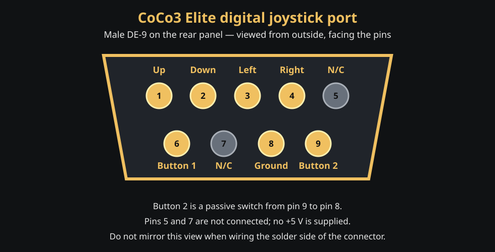

# PMOD Atari/C64 digital joystick interface

## Scope

The initial CoCo3 Elite physical-joystick interface connects one passive
Atari/C64-style digital joystick to PMOD **J10**. It supports four directions,
the standard fire button, and an optional second passive fire button.

The joystick defaults to the CoCo **right joystick** input. Press **F7** to
move the complete physical joystick between the right and left CoCo ports.
Button 1 is the selected joystick's primary fire button and button 2 remains
its genuine CoCo 3 second button. The CoCo 3 PIA provides separate first- and
second-button inputs for both joystick ports, so neither button borrows a
signal from the opposite joystick. F7 moves both button inputs together.



The drawing is the male DE-9 connector on the CoCo3 Elite rear panel, viewed
from outside the enclosure while facing the pins. A cable-side solder view is
mirrored. Atari and Commodore hosts conventionally use a male port and passive
joysticks use a female cable connector.

## DE-9 pinout

| DE-9 pin | Function | Electrical behavior | J10 pin | FPGA pin |
| ---: | --- | --- | ---: | --- |
| 1 | Up | Active low; switch to ground | 1 | D5 |
| 2 | Down | Active low; switch to ground | 2 | G5 |
| 3 | Left | Active low; switch to ground | 3 | G7 |
| 4 | Right | Active low; switch to ground | 4 | G8 |
| 5 | Not connected | Do not use | - | - |
| 6 | Button 1 / Fire | Active low; switch to ground | 7 | E5 |
| 7 | Not connected | **No +5 V is supplied** | - | - |
| 8 | Ground/common | Switch return | 5 or 11 | GND |
| 9 | Button 2 | Optional active-low passive switch | 8 | E6 |

J10 pins 9 (`D6`) and 10 (`G6`) remain unassigned. J10 pins 6 and 12 carry
3.3 V but are not connected to the DE-9.

Viewed from above the board, use the connector's printed pin-1 mark rather
than assuming orientation from the edge of the PCB:

```text
J10 signal row:   1 Up   2 Down   3 Left   4 Right   5 GND   6 3.3 V
J10 second row:   7 B1   8 B2     9 spare 10 spare  11 GND  12 3.3 V
```

## Direct adapter wiring

For a short prototype cable, route each of the six signal wires through a
470-ohm to 1-kilohm series resistor. The FPGA inputs use internal pull-ups and
the RTL synchronizes each asynchronous input through two flip-flops. A closed
joystick contact therefore pulls an input low; an open contact reads high.

```text
J10 signal ---- 1 kΩ ---- DE-9 direction/button contact
J10 GND  ---------------- DE-9 pin 8 common
```

The direct interface is intended only for an unpowered joystick made from
mechanical switches. Do not connect a joystick, mouse, paddle, autofire unit,
or other accessory that expects power on DE-9 pin 7 or drives a signal above
3.3 V. A permanent external board should add a 3.3 V Schmitt-trigger buffer
such as an SN74LVC14A, local 10-kilohm pull-ups, a 100 nF bypass capacitor,
series resistors, and ESD protection.

## Button 2 compatibility

Button 2 is a CoCo3 Elite extension: it must be a passive switch between DE-9
pin 9 and ground on pin 8. Standard one-button Atari/C64 joysticks leave pin 9
unused for this purpose and continue to work normally. Commodore paddle/mouse
signals and Atari 7800 two-button electrical conventions are not supported by
this direct adapter.

## Runtime behavior

- Physical movement controls the right joystick after reset; F7 toggles J10
  between the right and left CoCo joystick ports.
- Button 1 is primary fire; button 2 is the selected physical joystick's
  genuine second button.
- The PIA matrix order is right Button 1, left Button 1, left Button 2, then
  right Button 2. This non-paired ordering matches the CoCo 3 hardware.
- Opposite directions pressed together resolve to the centered axis value.
- Inputs are ignored while the F11/F12 management overlay is active and while
  the CoCo is being reset.
- F8 keyboard joystick emulation remains available and can be used at the same
  time as the physical joystick. It does not override idle J10 inputs.

An on-demand serial trace ends in `J=xx`. Bit 6 is the F7 port selection
(`1` right, `0` left); bits 5 through 0 are button 2, button 1, right, left,
down, and up. This directly verifies whether the FPGA sees each grounded J10
contact without depending on a game's joystick selection.

The board constraints are in `constraints/wukong.xdc`; synchronization is in
`rtl/wukong/pmod_atari_joystick.v`.
