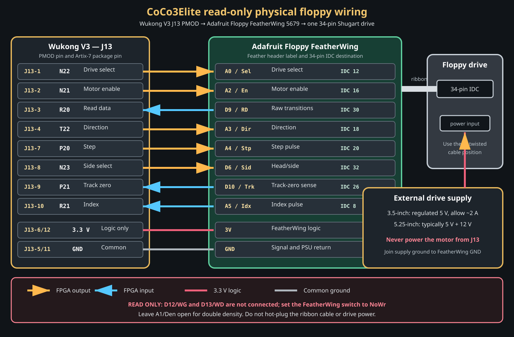

# Read-only physical floppy interface

## Scope

This document defines the proposed first physical-floppy interface for
CoCo3Elite. It connects the Wukong V3 **J13 PMOD** to the
[Adafruit Floppy FeatherWing with 34-pin IDC connector, product 5679][product].
The first implementation is deliberately limited to one drive and read-only
operation. The Adafruit board is a FeatherWing, not a PMOD, so a short custom
cable or passive interposer is required.


*Product photograph: Adafruit Industries. See the [product page][product],
[pinout guide][pinouts], and [open PCB design files][pcb].*

The repository-owned connection drawing is shown below. It is a logical wiring
diagram, not a mechanical footprint or PCB fabrication drawing.



## Why J13

The normal build now uses the Wukong onboard MicroSD socket, leaving J13 free.
J10 remains assigned to the Atari-style joystick and J14 remains assigned to
the PS/2 keyboard. J11 remains available for the proposed cassette/audio
interface. A build that selects the alternate J13 PMOD MicroSD mapping cannot
also use the physical floppy interface.

Five drive-control outputs and three status/data inputs fit exactly in J13's
eight FPGA signal positions. The omitted signals are not needed to prove
read-only sector access:

- `DEN` is left unconnected. The FeatherWing pull-up selects double density.
- `WRITE GATE` and `WRITE DATA` are left unconnected.
- `WRITE PROTECT`, `DISK CHANGE`, and `READY` are omitted from the first
  interface. Read-only policy is enforced by wiring, not just HDL.

## J13-to-FeatherWing wiring

The FeatherWing names in this table are the labels on the standard Feather
header. The **Feather pad** column gives the numbered through-hole pad in
Adafruit's published PCB design; it is distinct from the 34-pin floppy IDC
number. The active-low names describe the drive-side Shugart signals after the
FeatherWing's level translators. The FPGA-facing signals are 3.3 V logic.

| J13 pin | FPGA pin | Direction at FPGA | Feather label / signal | Feather pad | Floppy IDC pin | Function |
| ---: | --- | --- | --- | ---: | ---: | --- |
| 1 | N22 | Output | `A0` / `Sel` | 5 | 12 | Select the single drive |
| 2 | N21 | Output | `A2` / `En` | 7 | 16 | Spindle motor enable |
| 3 | R20 | Input | `D9` / `RD` | 21 | 30 | Raw read-data transitions |
| 4 | T22 | Output | `A3` / `Dir` | 8 | 18 | Step direction |
| 5 | GND | Power return | `GND` | 4 | — | Common signal ground |
| 6 | 3.3 V | Logic power | `3V` | 2 | — | FeatherWing logic and level-shifter supply |
| 7 | P20 | Output | `A4` / `Stp` | 9 | 20 | Head-step pulse |
| 8 | N23 | Output | `D6` / `Sid` | 20 | 32 | Side/head select |
| 9 | P21 | Input | `D10` / `Trk` | 22 | 26 | Track-zero sense |
| 10 | R21 | Input | `A5` / `Idx` | 10 | 8 | Index pulse |
| 11 | GND | Power return | `GND` | 4 | — | Common signal ground |
| 12 | 3.3 V | Logic power | `3V` | 2 | — | Same 3.3 V rail as pin 6 |

Use both PMOD grounds. Pins 6 and 12 are the same Wukong 3.3 V rail; a
fabricated interposer may join both to the FeatherWing `3V` rail. Confirm J13
pin 1 from the Wukong silkscreen before applying power.

Do not connect the following FeatherWing header pins in this read-only cable:

| FeatherWing pin | Signal | Required state |
| --- | --- | --- |
| `A1` | `Den` | Leave open; onboard pull-up requests double density |
| `D12` | `WG` | Leave open and set the board switch to `NoWr` |
| `D13` | `WD` | Leave open |
| `D11` | `Pr` | Leave open in the first prototype |
| `D5` | `CH` | Leave open |

## Power and electrical safety

The Wukong PMOD pins and FeatherWing host side use 3.3 V logic. The
FeatherWing supplies the required drive-side 5 V-compatible level translation;
never bypass it or wire a 34-pin drive signal directly to the FPGA.

The PMOD connector must **not** power the floppy mechanism. Provide a separate,
regulated drive supply:

- Most 3.5-inch drives require 5 V with enough startup current. Adafruit
  recommends allowing approximately 2 A.
- Many 5.25-inch drives require both 5 V and 12 V.
- Join the drive-supply ground to the FeatherWing/Wukong signal ground.
- Do not connect the drive supply's 5 V or 12 V rail to J13.
- Do not hot-plug the drive power or 34-pin ribbon cable.

Keep the FeatherWing write-enable switch in the **`NoWr`** position. Because
`WG` and `WD` are absent from this cable, an FPGA or firmware fault cannot
assert the write path.

## Ribbon cable and drive selection

The FeatherWing connects `Sel` to 34-pin IDC `SELECT1` (pin 12). It does not
connect the other drive-select lines. Use one drive on the straight,
**untwisted** portion of a PC floppy ribbon cable as described by Adafruit.
Verify cable keying and continuity: some older mechanisms have missing or
nonstandard connector keys.

A 3.5-inch 720K-capable mechanism with double-density media is convenient for
initial electrical tests. Reading original CoCo 5.25-inch media requires a
suitable 5.25-inch mechanism and its required 5 V/12 V supply.

## FPGA implementation boundary

The physical backend should preserve the existing FDC sector request/response
contract:

```text
CoCo WD1773 command
    -> existing coco3_fdc sector request
    -> physical backend selects, seeks, and waits for index
    -> read-data pulse capture and 250-kbit/s MFM clock recovery
    -> ID/data address-mark detection and CRC-16 verification
    -> existing 256-byte FDC sector buffer
    -> completion or not-ready / CRC / record-not-found status
```

Timing-sensitive pulse capture, clock recovery, and MFM decoding belong in
RTL. The management CPU may select the backend, manage motor timeout policy,
and expose diagnostics, but it must not poll GPIO for individual flux pulses.

The first target is ordinary 160K Disk Extended Color BASIC media: 35 tracks,
one side, 18 sectors per track, and 256 bytes per sector. Side selection is
wired from the beginning so 360K, two-sided OS-9 media can follow without a
hardware change.

## Safe inactive states

The future floppy-specific XDC and top-level wrapper must ensure that reset and
FPGA configuration leave the drive inactive:

| Signal | Reset state |
| --- | --- |
| Select | Inactive/high |
| Motor enable | Inactive/high |
| Step | Inactive/high; no transition during reset release |
| Direction | Stable before any step pulse |
| Side select | Side 0 |

Input pins should use 3.3 V LVCMOS constraints and only the pull behavior
required by the FeatherWing interface. Do not reuse the J13 SD-card constraint
fragment for this build; a separate, mutually exclusive floppy constraint
fragment is required.

## Bring-up sequence

1. Continuity-test every interposer connection with all equipment unpowered.
2. Power only the Wukong and FeatherWing. Verify inactive control outputs and
   sensible pulled-up input states over the serial debug interface.
3. Connect the unpowered drive and ribbon cable, then apply the external drive
   supply. Confirm index pulses and track-zero state without moving the head.
4. Add bounded seek-to-track-zero and single-step tests with serial telemetry.
5. Capture raw read-data pulse intervals from one revolution and compare them
   against simulation fixtures.
6. Add MFM decoding, address-mark detection, sector CRC, and a read-only sector
   command.
7. Connect the physical backend to `coco3_fdc`, run `DIR`, and load files from
   known-good media.
8. Validate reset, missing-media, reversed-cable, CRC-error, and motor-timeout
   recovery before enabling the backend in normal builds.

## Implementation status

The first implementation milestone provides J13 input telemetry plus a bounded
motor/select diagnostic. Build it
with the onboard SD-card slot so J13 is available:

```powershell
.\scripts\build_wukong.ps1 -PhysicalFloppy -SdSlot ONBOARD
```

This build applies `constraints/wukong_floppy_j13.xdc`, synchronizes index,
track-zero, and read-data inputs, and exposes their state through the serial
`FLOPPY` command. `FLOPPY START` selects the drive and enables its motor for a
hard-limited 10 seconds; `FLOPPY STOP` ends the interval immediately. The FPGA
watchdog is independent of firmware.

`FLOPPY HOME` is the first bounded head-motion operation. It waits 500 ms for
spin-up, uses the direction selected at runtime with `FLOPPY DIR 0` or
`FLOPPY DIR 1`, and issues no more than 85 active-low STEP pulses. Each pulse is
20 us with 6 ms between pulses. TRACK0 ends the seek successfully; timeout or
`FLOPPY STOP` removes STEP, motor, and select in hardware. `FLOPPY STEP`
permits one guarded pulse at a time while the drive is active, and `FLOPPY
SIDE 0/1` changes the side-select level. These runtime controls avoid rebuilding
the bitstream while diagnosing older mechanisms. All write signals remain
absent.

The next milestone is also implemented: the FPGA can capture one complete
index-to-index revolution of raw read-data timing from either selected head.
It stores a 1024-interval window in one 18 Kbit BRAM and computes complete-turn
counts, minimum/maximum spacing, and an order-sensitive hash. The management
firmware uploads buffered windows over the CH340N serial link at the normal
460800 baud with a per-window CRC-32.
`scripts/capture_physical_floppy_flux.ps1` reconstructs all windows and writes
little-endian raw intervals, forward and reversed CSV views, and JSON metadata.
See `docs/SERIAL_API.md` for the wire protocol and file formats.

Hardware validation with the current Mitsumi/Newtronics D502 produced roughly
47,390 transitions per revolution from its working lower/second head. Its
known-faulty upper head produced only sparse transitions with saturated gaps;
the side-select path works, but those samples are not usable disk data. The
design does not yet decode FM/MFM or connect a physical drive to the emulated
FDC.

Write support is a separate future design. It requires at least `WG`, `WD`, and
write-protect sensing, so it will require another connector or an active
interposer and a new safety review.

[product]: https://www.adafruit.com/product/5679
[pinouts]: https://learn.adafruit.com/adafruit-floppy-featherwing-with-34-pin-idc-connector/pinouts
[pcb]: https://github.com/adafruit/Adafruit_Floppy_FeatherWing_PCB
