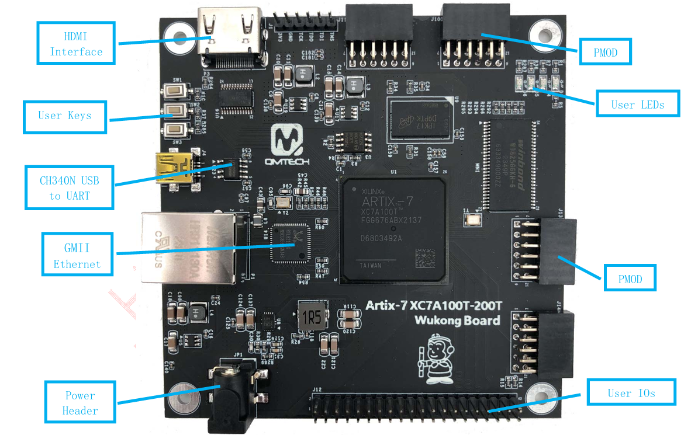
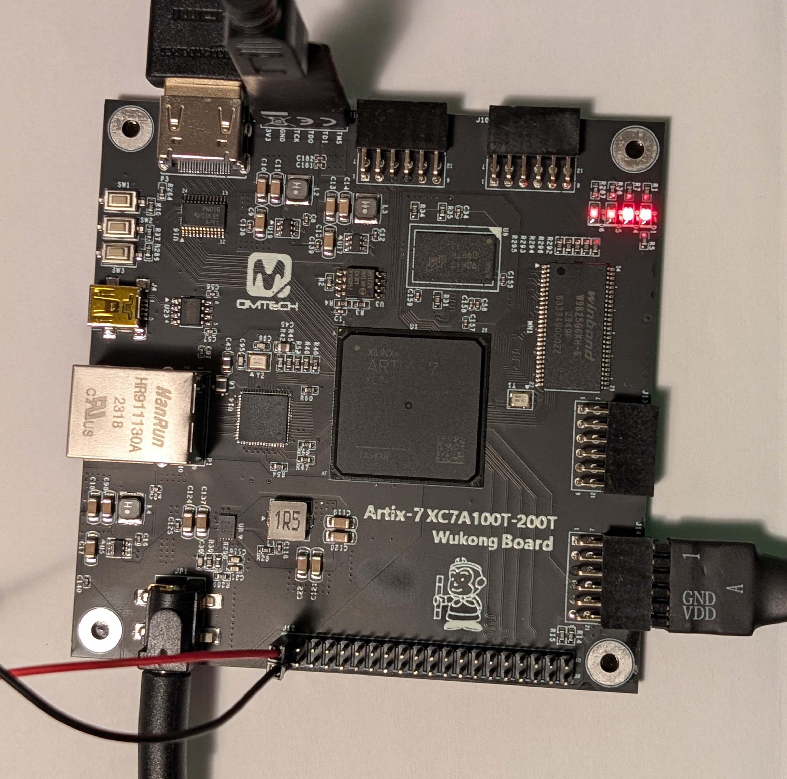

# QMTECH Wukong V3 Board

## Board overview

The implemented hardware target is the QMTECH Wukong V3 with an Artix-7
`XC7A100T` in the FGG676 package. The board supplies the FPGA resources and
physical interfaces needed to build a self-contained CoCo 3 without relying on
DriveWire or a host computer for storage.

*QMTECH Wukong V3 showing its principal external interfaces. The exact FPGA
and speed grade should be confirmed from the marking on the fitted device.*

*Hardware test setup with HDMI video, JTAG programming, board power, and the
PS/2 keyboard interface connected to PMOD J14.*

## Interface status

| Board resource | Project status | Intended use |
| --- | --- | --- |
| 50 MHz oscillator | Used | Input clock for the CoCo system and HDMI clock generation |
| HDMI output | Used | 640x480 digital video output for the CoCo display |
| JTAG header | Used | Volatile FPGA programming and hardware testing |
| Artix-7 block RAM | Used | 128 KiB CoCo main memory, system ROM, character ROM, and supporting buffers |
| PMOD J14 | Implemented and verified | Direct clock, data, and power for the HP KB-0133 PS/2 keyboard |
| Micro SD slot | Planned | Direct local disk-image storage over SPI; DriveWire is not planned |
| Remaining PMOD connectors | Planned | External audio, joystick ADC, and optional I2C RTC modules |
| CH340N USB-to-UART | Optional | Diagnostic console or independent RS-232 PAK; not storage and not a USB keyboard host |
| User keys | Unassigned | Candidate reset, cold-start, or maintenance controls |
| User LEDs | Unassigned | Candidate power, storage activity, keyboard, or diagnostic indicators |
| 40-pin user I/O header | Reserved | Additional expansion after the PMOD assignments are established |
| 32 MB SDRAM | Deferred | Possible expanded memory or RAM-disk support |
| 256 MB DDR3 | Deferred | Possible large-memory configuration; unnecessary for the base 128 KiB system |
| GMII Ethernet | Not planned | Available on the board but outside the initial CoCo3FPGA port scope |

## Interfaces currently used

### Clock

The board's 50 MHz oscillator drives the FPGA at package pin `M21`. The Vivado
clocking block derives the pixel and serializer clocks required for HDMI. The
current design does not require an additional external oscillator.

### HDMI

The onboard HDMI connector carries the current CoCo display. The implemented
path uses three TMDS data pairs and one TMDS clock pair. HDMI DDC, CEC, audio,
and hot-plug detection are not currently required.

### JTAG

The generated `.bit` file is loaded through the six-pin JTAG header. Persistent
SPI-flash boot can be added later; JTAG remains the bring-up and diagnostic
programming path.

### Internal block RAM

The base system uses 128 KiB of inferred dual-port block RAM, so external DDR3
is not needed for the standard CoCo 3 configuration. Video and CPU accesses
share the inferred memory through separate ports.

## Planned interfaces

### PS/2 keyboard

The hardware-verified HP KB-0133 keyboard uses PMOD J14:

| Function | J14 pin | FPGA pin |
| --- | ---: | --- |
| PS/2 clock | 1 | P23 |
| PS/2 data | 2 | R23 |
| Ground | 5 | GND |
| Keyboard power | 6 | 3.3 V |

The keyboard selected for this project is confirmed to operate at 3.3 V and
can connect directly. Other PS/2 keyboards may require 5 V and a suitable
open-drain-compatible level shifter because the Artix-7 pins are not 5 V
tolerant. See `keyboard-ps2.md` for the complete wiring and constraint guidance.

### Direct Micro SD storage

The onboard Micro SD slot is the planned mass-storage interface. It will use
the existing CoCo3FPGA SPI-controller concepts adapted to the Wukong pinout.
Disk images will be read locally from the card; DriveWire will not be ported.

### Audio

Audio is planned through an external PMOD-compatible DAC or audio module. An
I2S DAC is preferred because the existing design already represents digital
left and right audio streams. The connector assignment remains open.

### Joysticks

Original CoCo analog joystick behavior requires external analog-to-digital
conversion because the FPGA pins accept digital signals only. A PMOD ADC or a
small dedicated interface board is planned. Its connector is not yet assigned.

### Real-time clock

A DS3231-compatible I2C RTC may be attached through a remaining PMOD connector.
This is optional and should be assigned only after keyboard, storage, audio,
and joystick pin requirements are fixed.

### Expanded memory

The onboard SDRAM or DDR3 may eventually support expanded CoCo memory or a RAM
disk. These devices require additional controllers and arbitration and are not
needed for the current 128 KiB implementation.

## Supporting documentation

- `wukong-pmod-pinout.md` lists every signal and power pin for PMOD connectors
  J10, J11, J13, and J14.
- `keyboard-ps2.md` documents the PS/2 electrical interface and planned Vivado
  constraints.
- The vendor V3 PDF manuals and schematics are stored under `docs/`.
